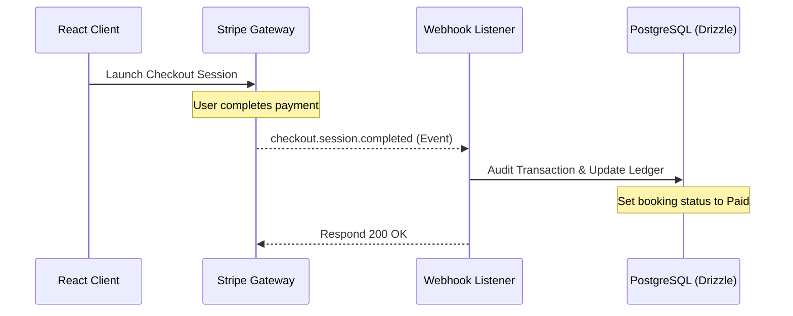

# ✈️ TourMax AI: Next-Gen Travel Booking & AI Itinerary Platform

<div align="center">
  <a href="https://tourmax-app.vercel.app" target="_blank">
    
  </a>
  
  
  
  
  <br />
  
  
  
  
</div>

<br />

TourMax AI is a full-stack booking application that solves the problem of travel planning fatigue. By integrating Llama-3.3-70b-versatile streaming directly into the user interface, it provides instant, multi-day personalized itineraries, visual AI search, and a secure booking checkout pipeline.

---

> ### 🔒 Security & Intellectual Property Note
> This repository is a public showcase of the platform's frontend, system architecture, database models, and API definitions. **To protect proprietary transaction reconciliation algorithms, stripe credentials, and custom AI prompt weights, the live backend API endpoints and webhooks operate on a secure, private repository.** The frontend components, type systems (tRPC models), and routing structures are open-sourced here for architectural review.

---

## ✨ Core Features

*   **📅 AI Trip Planner**
    *   Streams customized multi-day itineraries based on travel duration, budget, and styles.
    *   Uses strict JSON output validation to map AI streams directly to React UI cards.
*   **📷 Visual Search**
    *   Analyzes uploaded user images to recommend contextually relevant tours.
*   **💬 Smart Chatbot Widget**
    *   Natural language chatbot guiding users through bookings.
*   **💳 Stripe checkout Integration**
    *   Full Stripe Checkout flow integrated with robust backend webhook listeners.

---

## 🛠️ Key Architectural Decisions

| Layer | Technology | Key Implementation |
| :--- | :--- | :--- |
| **Type Safety** | tRPC + Express | End-to-end type safety between database queries and React component rendering. Prevents silent runtime API mismatches. |
| **AI Stream Engine** | Llama-3.3-70b-versatile | Enforces strict JSON schemas (`response_format: "json_object"`) to dynamically render structured cards during AI streaming. |
| **Reconciliation** | Stripe Webhook Pipeline | Audits checkout sessions asynchronously to confirm payments and update ledgers even if the user closes their browser. |
| **Database ORM** | Drizzle ORM + PostgreSQL | Relational modeling with automated cascades and typed queries. |

---

## 📐 Stripe Webhook Lifecycle



---

## ⚙️ How to View Locally (Frontend Only)

1. Clone this repository.
2. Install dependencies:
   ```bash
   npm install
   ```
3. Start the development server:
   ```bash
   npm run dev
   ```
